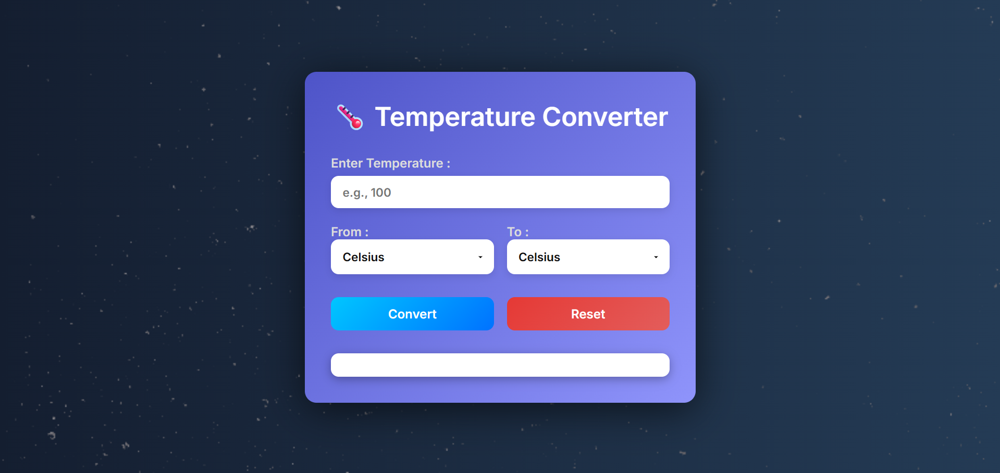
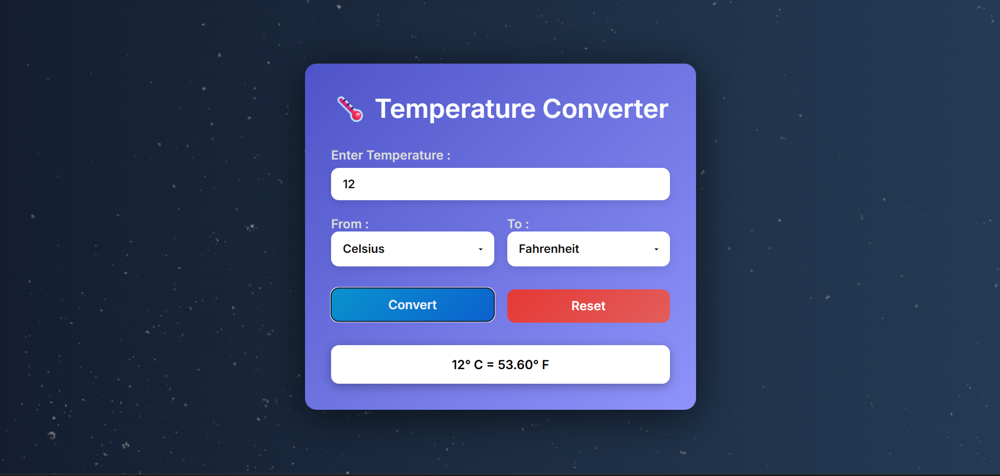

## 🌡️ Temperature Converter Web App

A simple, stylish, and responsive web application that allows users to convert temperatures between **Celsius**, **Fahrenheit**, and **Kelvin**. Built using **HTML**, **CSS**, and **JavaScript**, it provides a visually pleasing and user-friendly experience. 

---

### 🔥 Features

-  **Animated background** with gradient and texture
-  Clean and **modern UI design**
-  Fully **responsive layout**
-  Convert between **Celsius, Fahrenheit, and Kelvin**
-  **Reset** functionality to clear input and output
-  Error handling for invalid input
-  Clearly styled dropdowns and result display

---

### 🛠️ Tech Stack
- HTML – Page structure
- CSS – Styling with gradients and animations
- JavaScript – Logic for temperature conversion
- Google Fonts (Inter) – Clean, modern typography

---

## 🛠️ How to Run

1. Clone or download the repository
2. Open `index.html` in any browser

```bash
git clone https://github.com/PratimaPanigrahi/Temperature_convertor.git

```
## 🖼️ Screens Overview

### 1. 🏁 Start Page [Screenshot]
-	On Run 

&nbsp;


---

### 📘 What I Learned
- Built a clean, responsive UI using HTML, CSS, and JS.
- Applied custom gradients, shadows, and font styling.
- Implemented accurate temperature conversion logic.
- Handled user input and real-time result display.
- Improved UX with visual feedback and button effects.

---
## 📄 License

This project is open-source and free to use. Customize as you like!
